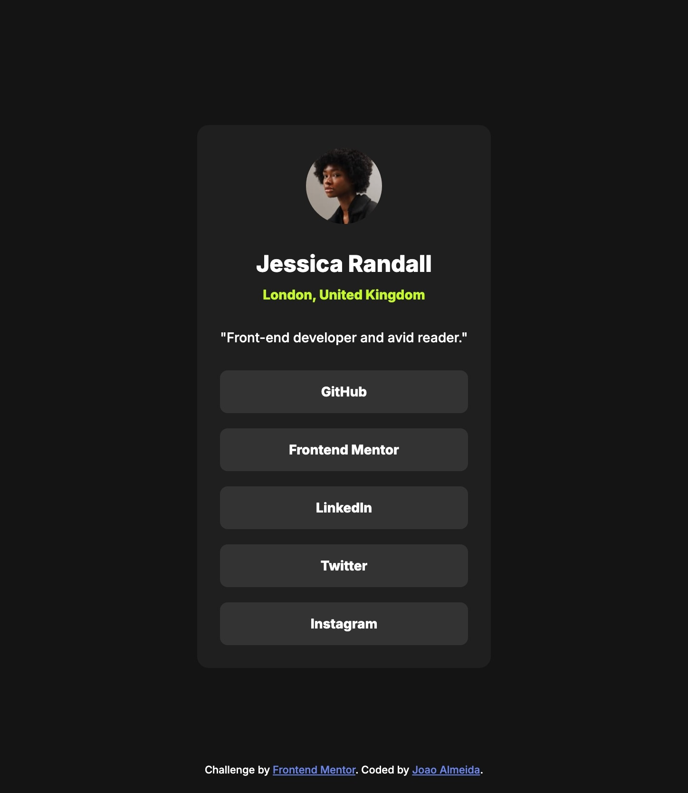

# Frontend Mentor - Blog preview card solution

This is a solution to the [Social links profile challenge on Frontend Mentor](https://www.frontendmentor.io/challenges/social-links-profile-UG32l9m6dQ). Frontend Mentor challenges help you improve your coding skills by building realistic projects.

## Table of contents

- [Overview](#overview)
  - [Screenshot](#screenshot)
  - [Links](#links)
- [My process](#my-process)
  - [Built with](#built-with)
  - [What I did](#what-i-learned)
  - [Continued development](#continued-development)
- [Author](#author)

## Overview

### Screenshot

### Links

- Solution URL: [Solution URL](https://github.com/joao-almeida11/social-links-profile)
- Live Site URL: [Live site URL](https://joao-almeida11.github.io/social-links-profile/)

## My process

### Built with

- Semantic HTML5 markup
- SCSS
- [React](https://reactjs.org/) - JS library
- [Storybook](https://storybook.js.org/) - JS library
- Mobile-first workflow

### What I did

- 2 components built in isolation on storybook

### Continued development

- Storybook
- CSS

## Author

- Website - [Joao Almeida](https://joao-almeida11.github.io/portfolio-2025/)
- Frontend Mentor - [@joao-almeida11](https://www.frontendmentor.io/profile/joao-almeida11)
